**In aws free tier account beware of NAT Gateway - It's expensive**
**1 GB of EBS per month, Do not create AMI's or save snapshots**
  
[What is Cloud Computing](https://www.zdnet.com/article/what-is-cloud-computing-everything-you-need-to-know-about-the-cloud/)

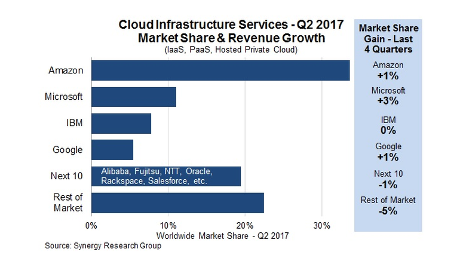

[aws core services](https://www.aws.training/Details/eLearning?id=29700)

[AWS Networking Fundamentals](https://youtu.be/hiKPPy584Mg)

[Aws docs VPCs and subnets](https://github.com/awsdocs/amazon-vpc-user-guide/blob/master/doc_source/VPC_Subnets.md#vpc-subnet-basics)

[AWS Foundations: Getting Started with the AWS Cloud Essentials](https://www.aws.training/Details/Video?id=49639)
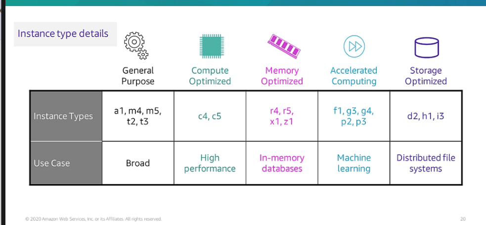

## [VPC](https://docs.aws.amazon.com/vpc/latest/userguide/VPC_Subnets.html)

**subnet is mandatory**

https://youtu.be/rQvl-V3tLiQ

[VPC Demo Edureka](https://youtu.be/UmoxXK_42aU)**

A virtual private cloud (VPC) is a virtual network dedicated to your AWS account. It is logically isolated from other virtual networks in the AWS Cloud

When you create a VPC, you must specify a range of IPv4 addresses for the VPC in the form of a Classless Inter-Domain Routing (CIDR) block; for example, 10.0.0.0/16

Availability Zones are multiple, isolated locations within each Region.

1. An internet gateway enables communication over the internet, and a virtual private network (VPN) connection enables communication with your corporate network.

If a subnet's traffic is routed to an internet gateway, the subnet is known as a public subnet

## [Subnet](https://docs.aws.amazon.com/vpc/latest/userguide/VPC_Subnets.html#vpc-subnet-basics)

Range of IP Adresses in the VPC.

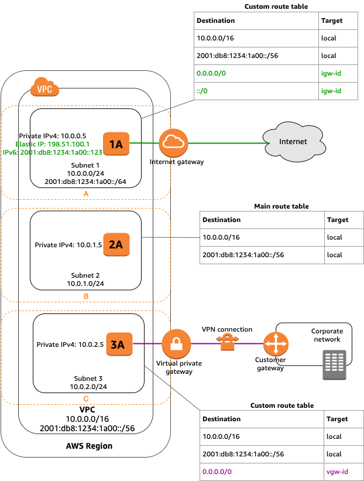

### Aws uses the first 4 and last 1 IP Address in a subnet forr internal purposes. So the subnet count is reduced by 5

If you create a VPC or subnet using a command line tool or the Amazon EC2 API, the CIDR block is automatically modified to its canonical form. For example, if you specify 100.68.0.18/18 for the CIDR block, we create a CIDR block of 100.68.0.0/18

[Tenancy Values]
## Dedicated Instances

Dedicated Instances are Amazon EC2 instances that run in a virtual private cloud (VPC) on hardware that's dedicated to a single customer

## Dedicated Host

A Dedicated Host is also a physical server that's dedicated for your use. With a Dedicated Host, you have visibility and control over how instances are placed on the server.

### [Difference b/w Dedicated Instance and Dedicated Host](https://docs.aws.amazon.com/AWSEC2/latest/UserGuide/dedicated-hosts-overview.html#dedicated-hosts-dedicated-instances)

## Elastic IP Address
 
**public IPv4 address or an Elastic IP address**

An Elastic IP address is a static IPv4 address associated with your AWS account in a specific Region.

## [EBS](https://docs.aws.amazon.com/AWSEC2/latest/UserGuide/AmazonEBS.html)
    
*The volume and instance must be in the same Availability Zone.*

    Elastic Block Store

VPC Endpoint
  - conect within aws (only available with s3 for now) a connection from private instance to an s3 bucket without nat. 

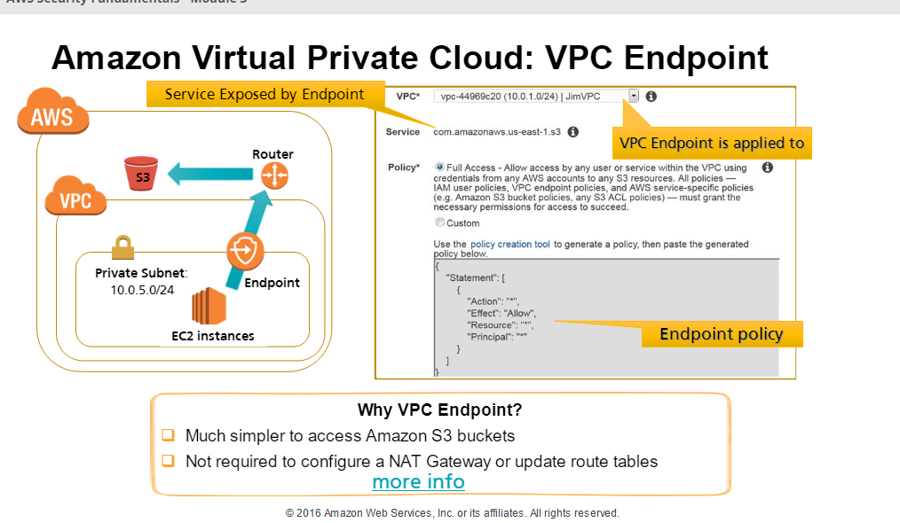

## Load Balancer

[AWS - ALB - Application Load Balancer - Setup & DEMO - Differences from Classic ELB](https://youtu.be/OKnd03nxu3k)

[AWS ELB Tutorial | Elastic Load Balancer Tutorial | AWS Tutorial | AWS Training Video | Simplilearn](https://youtu.be/YO4L_9poF3g)

[What’s The Difference Between Amazon EBS Vs EFS Vs S3?](https://www.missioncloud.com/blog/resource-amazon-ebs-vs-efs-vs-s3-picking-the-best-aws-storage-option-for-your-business#:~:text=The%20main%20differences%20between%20EBS,of%20backups%20or%20user%20files.)

   EBS is only accessible from a single EC2 instance in your particular AWS region 
   
   EFS allows you to mount the file system across multiple regions and instances
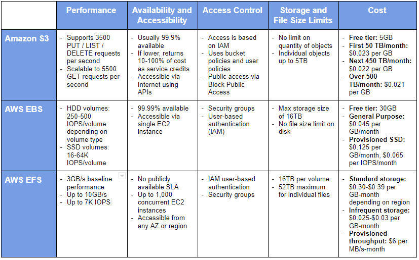

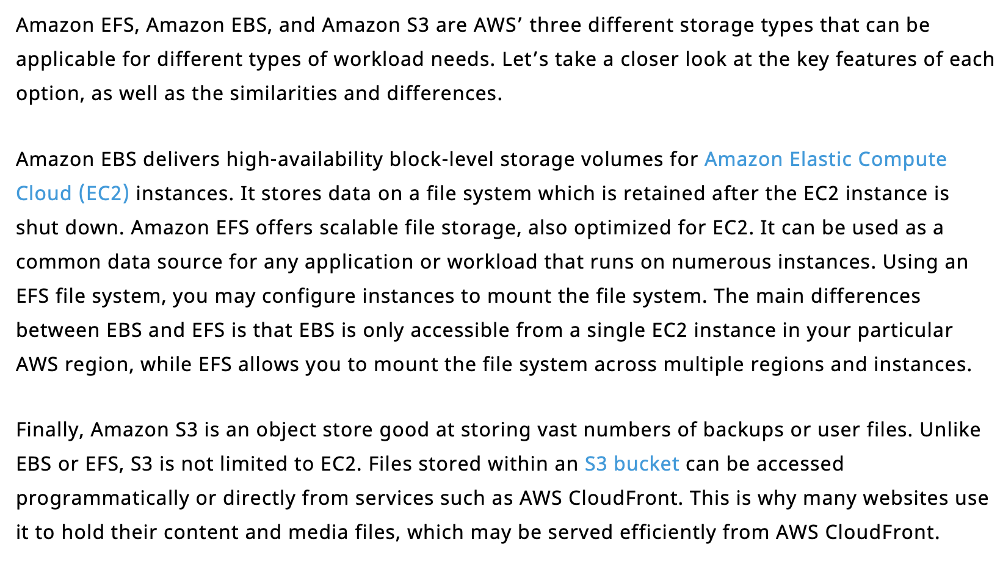

## Block Sorage vs Object
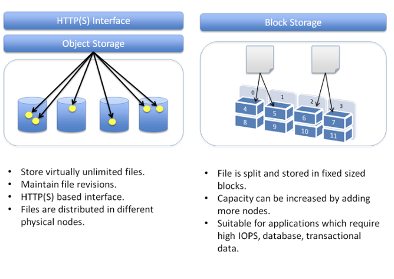

[Peer with a VPC in another Account](https://docs.aws.amazon.com/AWSCloudFormation/latest/UserGuide/peer-with-vpc-in-another-account.html)

[Aws Cloud Formation Templates](https://github.com/awslabs/aws-cloudformation-templates/blob/master/community/services/VPC/vpc_template.json)

## To include UserData in EC2 instance through clouf formation:

    UserData:
      Fn::Base64: | 
        #!/bin/bash
        yum update -y

## Cloud Formation User Data Logs :

    /var/log/cloud-init-output.log
    /var/log/cfn-init.log (cfn signal and wait logs)

[AWS CloudFormation VPC template](https://docs.aws.amazon.com/codebuild/latest/userguide/cloudformation-vpc-template.html)

[S3 Buckets](https://docs.aws.amazon.com/AmazonS3/latest/dev/Introduction.html#BasicsBucket)

[Restricting Access to Amazon S3 Content by Using an Origin Access Identity](https://docs.aws.amazon.com/AmazonCloudFront/latest/DeveloperGuide/private-content-restricting-access-to-s3.html#private-content-creating-oai-console)

[Serving private content with signed URLs and signed cookies](https://docs.aws.amazon.com/AmazonCloudFront/latest/DeveloperGuide/PrivateContent.html)

[Gateway VPC endpoints](https://docs.aws.amazon.com/vpc/latest/userguide/vpce-gateway.html)

## Cloud Trails
[What Is AWS CloudTrail?](https://docs.aws.amazon.com/awscloudtrail/latest/userguide/cloudtrail-user-guide.html)

## Elastic Beanstalk

[AWS Elastic Beanstalk Documentation](https://docs.aws.amazon.com/elastic-beanstalk/index.html)

    Platform as a service

Other Paas
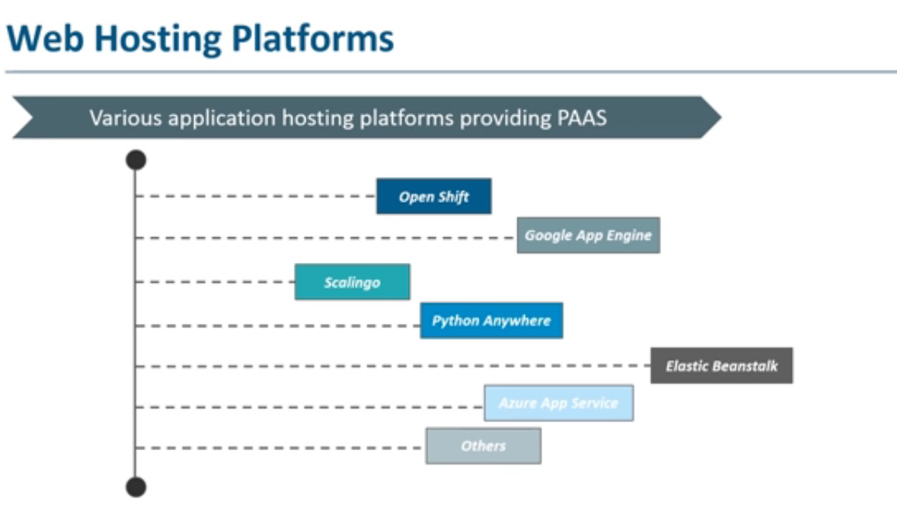

[Tutorial: Log the State of an Amazon EC2 Instance Using CloudWatch Events](https://docs.aws.amazon.com/AmazonCloudWatch/latest/events/LogEC2InstanceState.html)

## aws RDS - Relational Database Service

[Getting Started with Amazon RDS - Relational Database Service on AWS](https://youtu.be/knrNBkr5iTM)

[Amazon Relational Database Service (Amazon RDS)](https://youtu.be/igRfulrrYCo)

[AWS Tutorial - Launch a RDS MySQL instance and connect to it using Linux EC2](https://youtu.be/xzCgeRxSzy4)

## Amazon Aurora

[Amazon AURORA Explained | How does Aurora work? Visual Explanation](https://youtu.be/3DClteE-AUc)

## Aws Security Fundamentals

[AWS Security Fundamentals - Introduction to Cloud Computing and AWS Security](https://www.aws.training/Details/eLearning?id=10796)

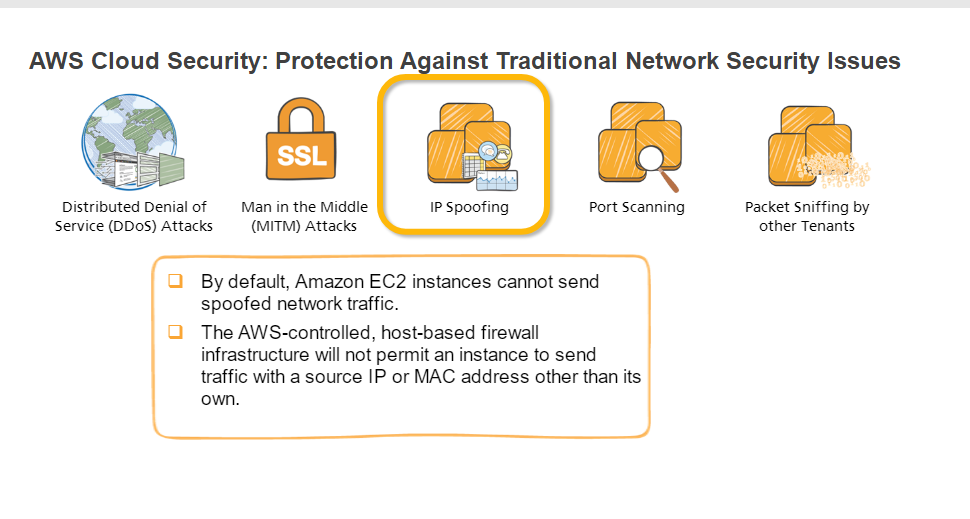

Compute Isolation
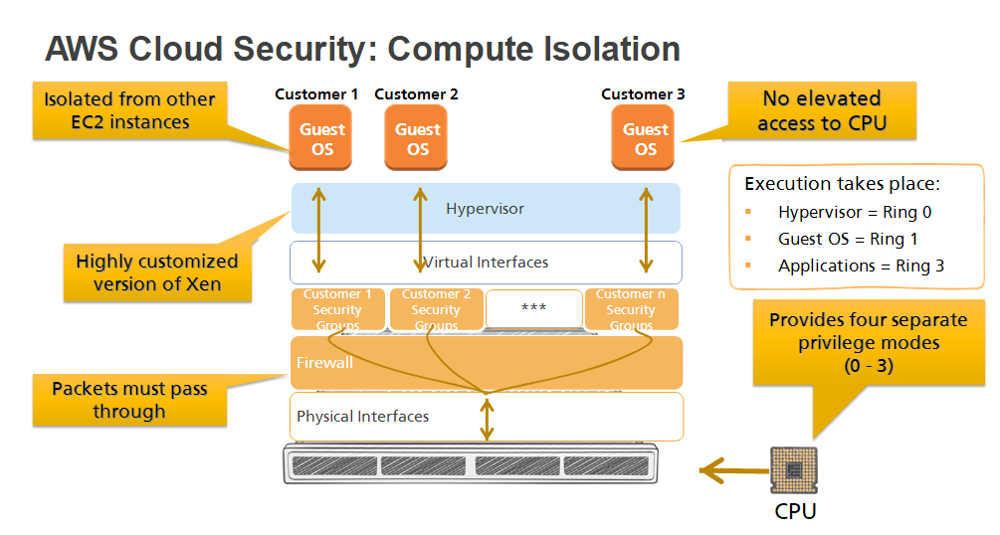

[Linux AMI virtualization types](https://docs.aws.amazon.com/AWSEC2/latest/UserGuide/virtualization_types.html)

## Aws Dash Services
[Dash Services](https://developer.amazon.com/dash-services)

Best Practices for Public Sector AWS Security Posture

## Securing AWS

[Best Practices for Public Sector AWS Security Posture](https://youtu.be/07V7oId_kLA)

## NACL's Vs Security Group
  - stateless - stateful

[Building APIs with Amazon API Gateway](https://youtu.be/XwfpPEFHKtQ)

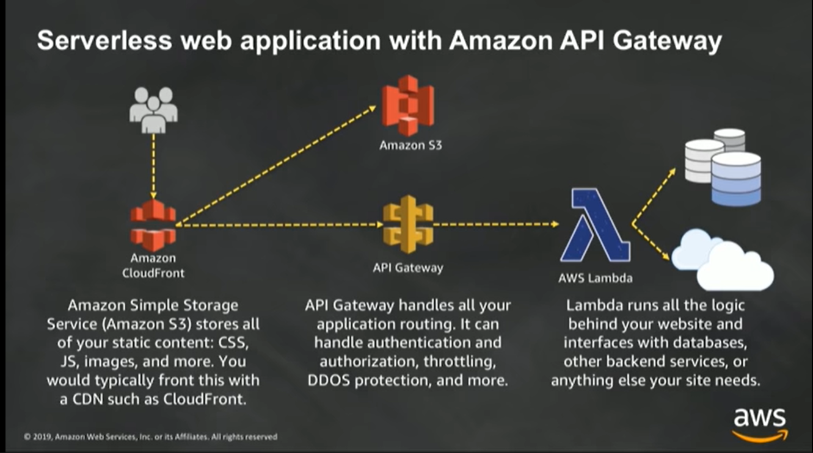

[AWS re:Invent 2019: [REPEAT 2] I didn’t know Amazon API Gateway did that (SVS212-R2)](https://youtu.be/yfJZc3sJZ8E)

[What is Amazon API Gateway?](https://docs.aws.amazon.com/apigateway/latest/developerguide/welcome.html)

[Creating a Lambda REQUEST authorizer function](https://docs.aws.amazon.com/apigateway/latest/developerguide/apigateway-websocket-api-lambda-auth.html)

[Building Real Time Applications using WebSocket APIs Supported by Amazon API Gateway](https://youtu.be/3SCdzzD0PdQ)

https://github.com/aws-samples/simple-websockets-chat-app

Aws Chatbot
[Getting started with Amazon Lex](https://aws.amazon.com/lex/getting-started/?nc=sn&loc=4)

[AWS Amplify - Fastest, easiest way to build mobile and web apps that scale](https://aws.amazon.com/amplify/)

## Aws Config

[What Is AWS Config?](https://docs.aws.amazon.com/config/latest/developerguide/WhatIsConfig.html)

  AWS Config provides a detailed view of the configuration of AWS resources in your AWS account. This includes how the resources are related to one another and how they were configured in the past so that you can see how the configurations and relationships change over time.

[AWS Config - Rules, Resources & Timelines with DEMO | IMPORTANT Security Service](https://youtu.be/BoHJVGzq-58)

### Managed Rules Templates
http://s3.amazonaws.com/aws-configservice-us-east-1/cloudformation-templates-for-managed-rules/EC2_MANAGEDINSTANCE_ASSOCIATION_COMPLIANCE_STATUS_CHECK.template

[Simplify Custom Rule Creation Using the AWS Config Rule Development Kit](https://youtu.be/7Iao8SR9Czg)

https://github.com/awslabs/aws-config-rdk

https://github.com/awslabs/aws-config-rules/tree/master/python

[Getting Started with Custom Rules for AWS Config](https://docs.aws.amazon.com/config/latest/developerguide/evaluate-config_develop-rules_getting-started.html)

[What is AWS Glue?](https://youtu.be/qgWMfNSN9f4)
  Extract Transform and Load

[AWS Athena Overview - Key Concepts | Serverless Interactive Query Service](https://youtu.be/UwnRi4ZDJEk)

[AWS Athena Tutorial l Athena Hands On LAB | Athena + Glue + S3 Data Lake | Athena AWS Tutorials](https://youtu.be/8VOf1PUFE0I)

[Serverless-Deployment](https://github.com/1CloudHub/Serverless-Deployment)

  AWS CloudFormation template creates the following resources in AWS account.

  -  Amazon S3 bucket to store the raw data
  - Glue Connection to connect source database
  - Glue Crawler and Glue Jobs
  - IAM roles for accessing AWS Glue and Amazon S3

[Uploading objects using presigned URLs](https://docs.aws.amazon.com/AmazonS3/latest/dev/PresignedUrlUploadObject.html)

[What is AWS Organizations?](https://docs.aws.amazon.com/organizations/latest/userguide/orgs_introduction.html)

[Service control policies](https://docs.aws.amazon.com/organizations/latest/userguide/orgs_manage_policies_scps.html)

[AWS Organization SCP - Service Control Policy DEMO | Blacklist & Whitelist strategy](https://youtu.be/_50P0o14Ul0)

[AWS Lumberyard](https://aws.amazon.com/lumberyard/)
    
    Free. Powerful. Fully Customizable.
    
    We believe game developers deserve another choice. That’s why we’re building Lumberyard: a game engine with no royalties or seat fees, frictionless integration with Twitch and AWS, plus much more on the horizon

[AWS Competency Program](https://aws.amazon.com/partners/competencies/)

[Working with AWS CloudFormation StackSe](https://docs.aws.amazon.com/AWSCloudFormation/latest/UserGuide/what-is-cfnstacksets.html)

    AWS CloudFormation StackSets extends the functionality of stacks by enabling you to create, update, or delete stacks across multiple accounts and regions with a single operation. Using an administrator account, you define and manage an AWS CloudFormation template, and use the template as the basis for provisioning stacks into selected target accounts across specified regions.

Aws CLI command to view Account ID:

    account_id=`aws sts get-caller-identity|jq -r ".Account"`

IP Range

## Cloud Development Kit - cdk
    
    Infrastructure as a code

https://cdkworkshop.com/

https://github.com/aws/aws-cdk