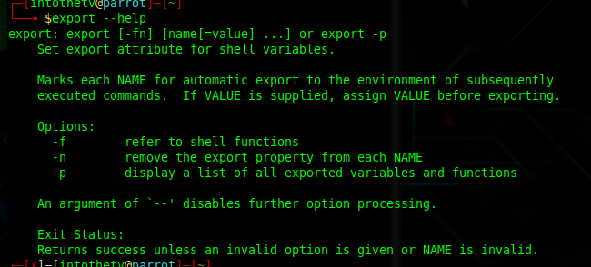
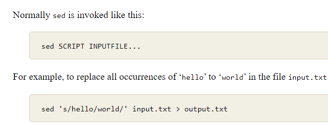
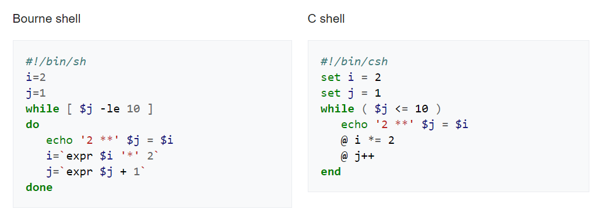
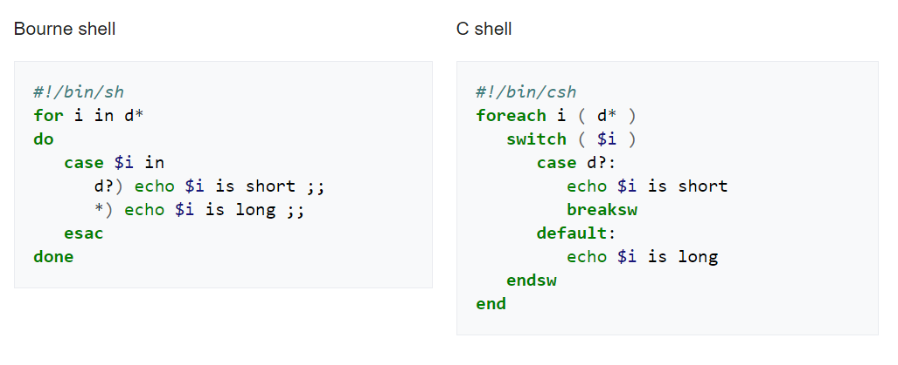
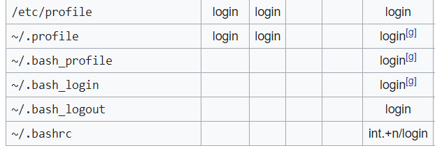
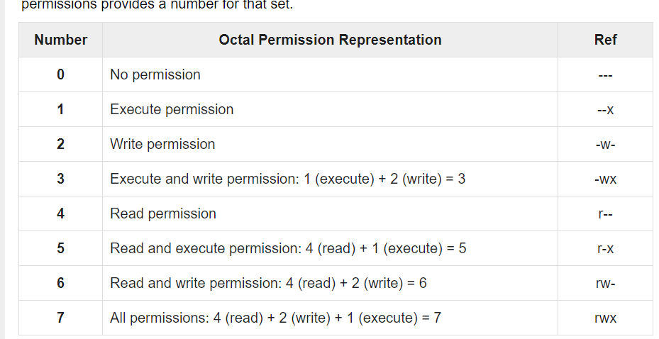

## Linux Basics

## basic Linux Commands

`info [OPTION]... [MENU-ITEM...]`

    infocommand reads documentation in the info format. It will give detailed information for a command when compared with the man page. The pages are made using the texinfo tools because of which it can link with other pages, create menus and easy navigation.

`df`

    report file system disk space usage

`du`
    
    estimate file space usage
    show how much space is utilized by a folder / file passed as argument

why difference ??

## [env](https://en.wikipedia.org/wiki/Env)

    Run a program in modefied environment or view environment variables

`env`

`export`

    set env variables 

[Shebang](https://en.wikipedia.org/wiki/Shebang_(Unix)) `#!`

`#!/usr/bin/env python3`

    refers to the python3 variable name in environment variables

`netstat`

`top` 

    displays processes

`htop`

    interactive process viewer    

[most](https://linux.die.net/man/1/most)

    most is a paging program that displays, one windowful at a time, the contents of a file on a terminal. It pauses after each windowful and prints on the window status line the screen the file name, current line number, and the percentage of the file so far displayed.

`free`

    displays memory details 
    

`/etc` - Usually contain the configuration files for all the programs that run on your Linux/Unix system.

[swap](https://www.cyberciti.biz/faq/linux-check-swap-usage-command/)

`swapon` or `swapoff` 

[less](https://linuxize.com/post/less-command-in-linux/)

    less > more

[Vim Cheatsheet](https://devhints.io/vim)

[Vim Sheet](https://vimsheet.com/)

    vi starts vim in ubuntu by default

[umask](https://www.computerhope.com/unix/uumask.htm#:~:text=On%20Linux%20and%20other%20Unix,show%20you%20its%20current%20value.)

[Telnet vs SSH](https://study-ccna.com/telnet-ssh/)
    
    tenet - not secure - port 23
    ssh - secure public key encryption   - port 22

`truncate`

    shrink or exppand a file for specific size

files greater than specific size

`find . -size +10k -ls`

NAT vs Proxy

    These two technologies differ in their positions in the TCP/IP protocol stack. NAT works at the network layer while proxy at the application layer. NAT is transparent to various applications, whereas proxy must resort to the IP address of the proxy server specified in application programs. For example, to access a web page by using NAT, no configuration is required in the browser. To access a web page by using a proxy, you must specify the IP address of the proxy in the browser. If the proxy supports only HTTP, only web servers can be accessed through the proxy, but not FTP. In terms of Internet access, NAT delivers higher scalability than proxy, because NAT is not targeted at applications.

[How to Copy Files From a Remote System (ftp)](https://docs.oracle.com/cd/E19253-01/816-4555/remotehowtoaccess-87541/index.html)
    
    oracle docs

`scp [OPTION] [user@]SRC_HOST:]file1 [user@]DEST_HOST:]file2`

`sed` [stream editor](https://www.gnu.org/software/sed/manual/sed.html#Common-Commands)

[examples](https://www.geeksforgeeks.org/sed-command-in-linux-unix-with-examples/)

[find](https://en.wikipedia.org/wiki/Find_(Unix)) 

    The related locate programs use a database of indexed files obtained through find (updated at regular intervals, typically by cron job) to provide a faster method of searching the entire file system for files by name.

`find ./GFG -name sample.txt -exec rm -i {} \;`

    {} means "the output of find". As in, "whatever find found". find returns the path of the file you're looking for, right? So {} replaces it; it's a placeholder for each file that the find command locates

    The \; part is basically telling find "okay, I'm done with the command I wanted to execute".

### [Symbolic Links](https://en.wikipedia.org/wiki/Symbolic_link)

To create a symbolic Link

`ln -s target_path link_path`

### [Cron](https://en.wikipedia.org/wiki/Cron)

    Job Scheduler

**Need Explore **
--- 

[Xargs](https://en.wikipedia.org/wiki/Xargs)
    
    Extended Arguments

[xargs examples](https://www.geeksforgeeks.org/xargs-command-unix/)

`awk`

    pattern scanning and processing language

`awk options 'selection _criteria {action }' input-file > output-file`

    The basic function of awk is to search files for lines (or other units of text) that contain certain patterns. When a line matches one of the patterns, awk performs specified actions on that line. awk continues to process input lines in this way until it reaches the end of the input files.

[awk examples](https://www.geeksforgeeks.org/awk-command-unixlinux-examples/)

## **Set Vs Export**

    set is limited to current session
    export 

    export sets attribute value for a environment variable

[nice](https://en.wikipedia.org/wiki/Nice_(Unix)#:~:text=nice%20is%20used%20to%20invoke,process%20and%20is%20usually%200.)

     A niceness of -20 is the highest priority and 19 is the lowest priority. The default niceness for processes is inherited from its parent process and is usually 0

[> clobbering](https://en.wikipedia.org/wiki/Clobbering)

    over writing

[rsync](https://www.digitalocean.com/community/tutorials/how-to-use-rsync-to-sync-local-and-remote-directories-on-a-vps)

[gzip](https://en.wikipedia.org/wiki/Gzip)

[How To Read and Set Environmental and Shell Variables on a Linux VPS](https://www.digitalocean.com/community/tutorials/how-to-read-and-set-environmental-and-shell-variables-on-a-linux-vps#:~:text=Environmental%20variables%20are%20used%20to,like%20the%20current%20working%20directory.)

    It reads the first file that it can find out of ~/.bash_profile, ~/.bash_login, and ~/.profile and does not read any further files.

`source`

    run a file that has list of commands line by line

[source example](https://bash.cyberciti.biz/guide/Source_command)

[exit status codes](https://shapeshed.com/unix-exit-codes/)

[C Shell csh](https://en.wikipedia.org/wiki/C_shell)

Files read by bash during login

[screen tool](https://linuxize.com/post/how-to-use-linux-screen/)

[Stayin alive with screen](https://developer.ibm.com/articles/au-gnu_screen/)

[Screen for remote interaction](https://www.linux.com/training-tutorials/using-screen-remote-interaction/)

[tumux cheat sheet](https://tmuxcheatsheet.com/)

[etc](https://tldp.org/LDP/Linux-Filesystem-Hierarchy/html/etc.html)

    This is the nerve center of your system, it contains all system related configuration files in here or in its sub-directories

[X Window System](https://en.wikipedia.org/wiki/X_Window_System)

    The X Window System (X11, or simply X) is a windowing system for bitmap displays, common on Unix-like operating systems.

command execute and use output as param

## [what does <<< mean ? - Here String ](https://unix.stackexchange.com/questions/80362/what-does-mean)

[Here Document](https://en.wikipedia.org/wiki/Here_document#Unix_shells)

## Shell Script Headers

[Shell Guide - used by googlers](https://google.github.io/styleguide/shellguide.html)

[Shell scripting with bash for Linux admin](https://www.pluralsight.com/guides/shell-scripting-with-bash-for-linux-administration-part-1)

DSA - Digital Signatre Algorithm

RSA - Look Up

https://help.ubuntu.com/community/SSH/OpenSSH/Keys

[Netsted Command Substitution](https://docstore.mik.ua/orelly/unix/upt/ch45_31.htm)

[Sub Shells](https://tldp.org/LDP/abs/html/subshells.html)

[Bash: setting and replacing values in a properties file use sed](https://fabianlee.org/2019/10/05/bash-setting-and-replacing-values-in-a-properties-file-use-sed/)

[Difference Between apt and apt-get Explained](https://itsfoss.com/apt-vs-apt-get-difference/)

    Debian uses a set of tools called Advanced Packaging Tool (APT) to manage this packaging system. Don’t confuse it with the command apt, it’s not the same.

[Sudoers-syntax](https://toroid.org/sudoers-syntax)

[Passwordless SSH into Remote Machine](https://www.tecmint.com/ssh-passwordless-login-using-ssh-keygen-in-5-easy-steps/)

`ssh-keygen -t rsa`
`ssh-copy-id -i ~/.ssh/id_rsa user@remote`

## Archiving Files

    tar - cvf c compress verbose f fillename x extract
    z single enc technique 
    tar -tgf g - gzip 
    tar -tgf j - bzip2 -- more speed less compression
    tar -x to unzip

Create folder tree in single command
    
`mkdir -p /home/sub1/sub2`

`rm -r /home/sub1/sub2`

`cp -r  <source-folder-tree> <destination>`

Download a file from link

`curl <link of the file> -O` 

-O to save the file, else it just prints out

`wget <link_to_file> -O "filename"`

Check OS Version

`ls /etc/*release*`

`cat etc/*release*`
 
Cent OS package manager
RPM - RedHat Package Manager

RPM does not install the dependency pakages, it just installs the \<package_name>.rpm file.

YUM is a High Level Package manager that overcomes this problem.

`yum install <package-name>`

yum uses rpm to install packages

repo info is stored at `/etc/yum.repos.d`

Using chmod with Absolute Permissions

    1 - Execute 
    2 - Write
    4 - Read