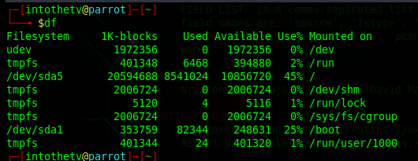

## Linux Basics

## basic Linux Commands

`info [OPTION]... [MENU-ITEM...]`

    infocommand reads documentation in the info format. It will give detailed information for a command when compared with the man page. The pages are made using the texinfo tools because of which it can link with other pages, create menus and easy navigation.

`df`

    report file system disk space usage

`du`
    
    estimate file space usage
    show how much space is utilized by a folder / file passed as argument

Create folder tree in single command
    
`mkdir -p /home/sub1/sub2`

`rm -r /home/sub1/sub2`

`cp -r  <source-folder-tree> <destination>`

`curl <link of the file> -O`

-O to save the file, else it just prints out

`wget <link_to_file> -O "filename"`

Check OS Version

`ls /etc/*release*`

`cat etc/*release*`
 
Cent OS package manager
RPM - RedHat Package Manager

RPM does not install the dependency pakages, it just installs the \<package_name>.rpm file.

YUM is a High Level Package manager that overcomes this problem.

`yum install <package-name>`

yum uses rpm to install packages

repo info is stored at `/etc/yum.repos.d`