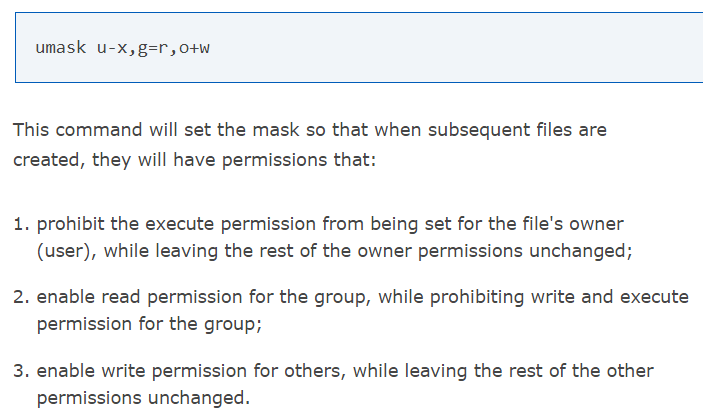

## Linux Basics

## basic Linux Commands

`info [OPTION]... [MENU-ITEM...]`

    infocommand reads documentation in the info format. It will give detailed information for a command when compared with the man page. The pages are made using the texinfo tools because of which it can link with other pages, create menus and easy navigation.

`df`

    report file system disk space usage

`du`
    
    estimate file space usage
    show how much space is utilized by a folder / file passed as argument

why difference ??

## [env](https://en.wikipedia.org/wiki/Env)

    Run a program in modefied environment or view environment variables

`env`

`export`

    set env variables 

[Shebang](https://en.wikipedia.org/wiki/Shebang_(Unix)) `#!`

`#!/usr/bin/env python3`

    refers to the python3 variable name in environment variables

`netstat`

`top` 

    displays processes

`htop`

    interactive process viewer    

`free`

    displays memory details 
    

`/etc` - Usually contain the configuration files for all the programs that run on your Linux/Unix system.

[swap](https://www.cyberciti.biz/faq/linux-check-swap-usage-command/)

`swapon` or `swapoff` 

[less](https://linuxize.com/post/less-command-in-linux/)

    less > more

[Vim Cheatsheet](https://devhints.io/vim)
    
    vi starts vim in ubuntu by default

[umask](https://www.computerhope.com/unix/uumask.htm#:~:text=On%20Linux%20and%20other%20Unix,show%20you%20its%20current%20value.)

[Telnet vs SSH](https://study-ccna.com/telnet-ssh/)
    
    tenet - not secure - port 23
    ssh - secure public key encryption   - port 22

`truncate`

    shrink or exppand a file for specific size

files greater than specific size

`find . -size +10k -ls`

NAT vs Proxy

    These two technologies differ in their positions in the TCP/IP protocol stack. NAT works at the network layer while proxy at the application layer. NAT is transparent to various applications, whereas proxy must resort to the IP address of the proxy server specified in application programs. For example, to access a web page by using NAT, no configuration is required in the browser. To access a web page by using a proxy, you must specify the IP address of the proxy in the browser. If the proxy supports only HTTP, only web servers can be accessed through the proxy, but not FTP. In terms of Internet access, NAT delivers higher scalability than proxy, because NAT is not targeted at applications.

[How to Copy Files From a Remote System (ftp)](https://docs.oracle.com/cd/E19253-01/816-4555/remotehowtoaccess-87541/index.html)
    
    oracle docs

`scp [OPTION] [user@]SRC_HOST:]file1 [user@]DEST_HOST:]file2`

---
Create folder tree in single command
    
`mkdir -p /home/sub1/sub2`

`rm -r /home/sub1/sub2`

`cp -r  <source-folder-tree> <destination>`

`curl <link of the file> -O`

-O to save the file, else it just prints out

`wget <link_to_file> -O "filename"`

Check OS Version

`ls /etc/*release*`

`cat etc/*release*`
 
Cent OS package manager
RPM - RedHat Package Manager

RPM does not install the dependency pakages, it just installs the \<package_name>.rpm file.

YUM is a High Level Package manager that overcomes this problem.

`yum install <package-name>`

yum uses rpm to install packages

repo info is stored at `/etc/yum.repos.d`